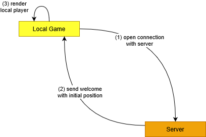
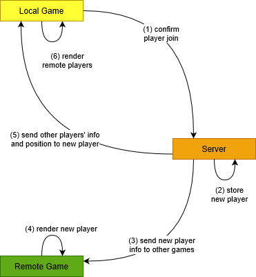
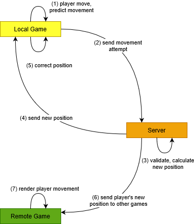
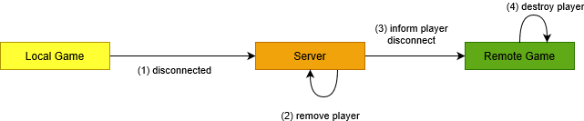

# Multiplayer game with Unity + Node.js

Proof of concept to excercise building a multiplayer game in Unity and to explore having a non-Unity authoritative server built in Node.js.

The client game uses **[Extenject](https://assetstore.unity.com/packages/tools/utilities/extenject-dependency-injection-ioc-157735)** as DI framework; **[Socket.IO for Unity](https://assetstore.unity.com/packages/tools/network/socket-io-for-unity-21721)** for connection with the server; and **Moq** for mocking in unit tests. 

The server uses **Socket.IO** and is written in **TypeScript** and then transpiled via **Webpack**. It uses **ESLint** and **Prettier** for linting and formatting, and uses **Jest** for unit testing.

The goal is to explore having a non-Unity authoritative server built in Node.js

## Flows

### Player initial connection

The socket sends the initial "connection" event to the server. The server calculates the initial position where to render the player and replies with a welcome message that has the position as payload. The client (game) then renders the local player.

### Player joins the game (confirms it is rendered locally)

Once rendered locally the game lets the server know this. The server registers the player and then proceeds to send existing players back and to broadcast the player to those other players.

### Player moves *- IN PROGRESS*

The player moves locally, then this information is sent to the server for validation. The server validates the position, sends it back and also sends the confirmed position to other players. 

The initiating game corrects position if it needs to and the other games render the position change for the player.

### Collisions *- NOT STARTED*

TBD

### Player actions: jump, shoot, etc *- NOT STARTED*

TBD

### Player disconnects

When a player closes the game the server updates the players list and informs other games about this.

## Collected information

### Basics

- [Translate](https://docs.unity3d.com/Manual/class-Transform.html)
- [Rigidbody](https://docs.unity3d.com/Manual/class-Rigidbody.html)

### Physics

- [Movement: Rigidbody vs Translate](https://www.youtube.com/watch?v=ixM2W2tPn6c)
- [Troubleshooting: character falling over problem](https://forum.unity.com/threads/character-falling-over-problem.160027/)
- [Rotation with Rigidbody](https://forum.unity.com/threads/can-not-move-and-rotate-at-the-same-time.734438/)

### ScriptableObjects

- [SO basics](https://www.youtube.com/watch?v=aPXvoWVabPY)
- [Using SO for game state](https://www.youtube.com/watch?v=55eB8_CctAM)

### Unity + Socket.IO

- [Pluralsight multiplayer game tutorial](https://app.pluralsight.com/library/courses/unity-multiplayer-game-dev-node-2454/table-of-contents)

### Multiplayer Network Movement

- https://www.youtube.com/watch?v=Glm0nJ4sO5E

### Unity Unit Testing

- https://www.raywenderlich.com/9454-introduction-to-unity-unit-testing
- https://blogs.unity3d.com/2014/05/21/unit-testing-part-1-unit-tests-by-the-book/
- https://blogs.unity3d.com/2014/06/03/unit-testing-part-2-unit-testing-monobehaviours/
- http://adamsingle.com/unit-testing-in-unity-with-zenject-unirx-and-moq/
- https://www.youtube.com/watch?v=9AMPDjaSmjQ